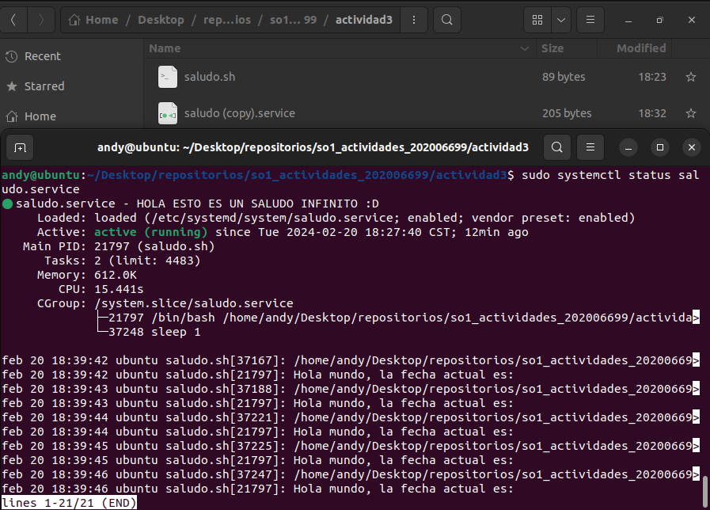

# Facultad de Ingeniería
## Escuela de Ciencias y Sistemas
### Sistemas Operativos 1 sección A
#### Ing. Jesús Alberto Guzmán Polanco

---

## Investigación conceptos de SO

### Andy Ezequiel Sanic Tiul
### 202006699
### 26 de enero de 2024

---

RETIRAMOS EL NOMBRE
retiramos (copy) y quedara así saludo.service
ejecutamos ahora los siguiente comandos

* MOVER A CARPETA 
Moveremos nuestro servicio a la siguiente carpeta `/etc/systemd/system/`

- TERMINAL
```bash
sudo mv saludo.service /etc/systemd/system/


- RECARGA Y HABILITACIÓN SERVICIO
esto genera que nuestro archivo sea reconocido y habilita nuestro
servicio

- TERMINAL
sudo systemctl daemon-reload
sudo systemctl enable saludo.service

- INICIAR SERVICIO
ahora iniciamos nuestro servicio 
- TERMINAL
sudo systemctl start saludo.service

- VERIFICAMOS EL ESTADO DEL SERVICIO
- TERMINAL
sudo systemctl status saludo.service
-Ejecucion



